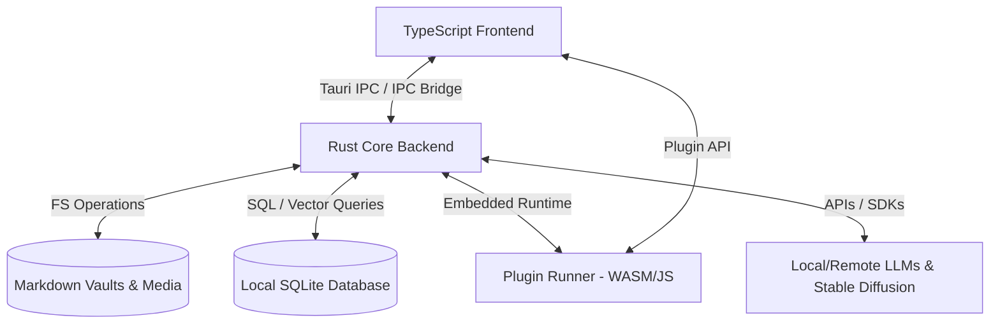

# Loreweaver Architecture

This document describes the technical architecture of Loreweaver, details the tech stack, data flows, and design decisions made to satisfy the core requirements.

---

## 1. High-Level Architecture

Loreweaver is built as a hybrid desktop application utilizing **Tauri** to link a high-performance **Rust** backend with a modern **TypeScript** frontend.



---

## 2. Tech Stack

### Backend (Rust)
- **Framework**: [Tauri v2](https://tauri.app/) — provides lightweight windowing, IPC, and security configuration.
- **Database**: [SQLite](https://www.sqlite.org/) (via `sqlx` or `rusqlite`) — stores metadata, indexing parameters, plugin registries, and system configurations.
- **Vector Search**: [sqlite-vec](https://github.com/asg017/sqlite-vec) (a lightweight vector search extension for SQLite) is used to support embedded vector embeddings inside the same single-file SQLite database.
- **Text Extraction & Processing**:
  - Markdown Parser: `pulldown-cmark`.
  - PDF/HTML extraction tools for importing rulebooks.
- **Embeddings & LLM Interface**: Local embedding generation via `ort` (ONNX Runtime in Rust) using a tiny model like `all-MiniLM-L6-v2`, and integration with local APIs (Ollama, Llama.cpp) and cloud APIs (OpenAI, Anthropic, Gemini).
- **Plugin Host**: An embedded JavaScript engine (using `deno_core` or `boa`) to execute third-party plugin code securely in JS/TS sandboxed environments.

### Frontend (TypeScript)
- **Framework**: [React](https://react.dev/) (using Vite as the build tool) — ensures fast, reactive interface updates.
- **Styling**: Vanilla CSS or HSL CSS Variables (glassmorphic, dark-mode first design).
- **Markdown Editor**: [Lexical](https://lexical.dev/) or [Milkdown](https://milkdown.dev/) or a customized Markdown editor supporting wiki-links (`[[Note Name]]`) and slash commands.
- **State Management**: Zustand or Signals.

---

## 3. Data Storage & Local-First Philosophy

Loreweaver stores campaign data inside a **"Campaign Vault"**, which is a normal directory on the user's hard drive.

- **Markdown Files**: Notes, worldbuilding entries, and descriptions are stored as plain Markdown. Users can open this directory in Obsidian, VS Code, or any text editor.
- **Frontmatter Metadata**: Structured information (e.g., character stats, location coordinate data, item properties) is stored as YAML/JSON frontmatter in the Markdown files:
  ```markdown
  ---
  type: npc
  system: dnd5e
  alignment: Chaotic Neutral
  hp: 45
  ac: 14
  tags: [faction/thieves-guild, status/alive]
  ---
  # Barnaby the Quick
  Barnaby is a swift-fingered rogue operating in the lower docks...
  ```
- **Sync & Indexing**: The Rust backend monitors this directory using the `notify` crate. When a file is created, updated, or deleted, Rust parses the frontmatter and content, updates the keyword search index (SQLite FTS5), and regenerates semantic embeddings (stored in `sqlite-vec`).

---

## 4. Semantic Search & Vector Embeddings

To achieve fast, local-first semantic search without cloud dependencies:
1. **Model**: A small, pre-trained sentence-transformer model (e.g., `all-MiniLM-L6-v2`) is downloaded once or packaged with the app.
2. **Execution**: The ONNX runtime (via `ort`) runs this model locally on the user's CPU/GPU.
3. **Storage**: Text chunks (e.g., specific paragraphs of rulebooks, campaign notes) and their 384-dimensional vector embeddings are stored in SQLite using `sqlite-vec`.
4. **Querying**: When a user queries their vault, the query is embedded, and SQLite runs a cosine-similarity search to pull the most contextually relevant chunks.

---

## 5. Plugin System & API

To allow community extensions without sacrificing app safety:
- **Sandbox Architecture**: Plugins are loaded in an isolated environment.
- **Manifest**: Plugins must declare permissions in a `manifest.json` (e.g., `network`, `filesystem:read`, `ui:register_view`).
- **Plugin API**: Exposed to the frontend and backend, providing hooks to modify rendering, intercept events, run custom calculations (e.g., dice rollers), and integrate new RPG systems.

---

## 6. AI Agent Orchestration & Memory

- **Context Assembly**: The app gathers relevant context using a hybrid search (keyword FTS5 + semantic vector).
- **Memory Backend**: Uses a graph structure (Factions, Locations, NPCs) to build short-term and long-term memory for AI-guided NPCs.
- **Agent Framework**: Rust-based agent loops that parse user prompts, consult rules, execute tool calls (e.g., "Lookup spell fireball", "Roll 1d20+3"), and generate narrative responses.
