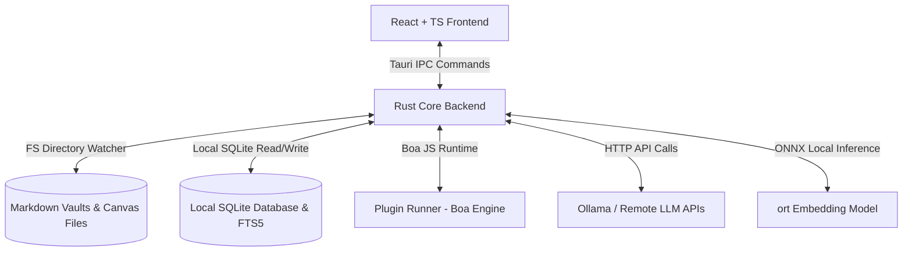

# Loreweaver Architecture

This document describes the technical architecture of Loreweaver, detailing the subsystems, data flows, and design decisions.

---

## 1. High-Level Architecture

Loreweaver is built as a hybrid desktop application utilizing **Tauri v2** to link a high-performance **Rust** backend with a modern **React + TypeScript** frontend.

---

## 2. Subsystem Implementations

### Frontend (React + TypeScript)
* **View Layer:** Component tree managing dashboard, campaign vault editor, rulebook browser, chat assistants, and system settings.
* **Markdown Editor:** Powered by [CodeMirror 6](https://codemirror.net/) (via `@uiw/react-codemirror`) with custom autocompletion hooks for internal note wikilinks (`[[Note Name]]`).
* **Interactive Canvas:** A vector graphic node-based visual layout rendered via SVG in the frontend (`FolderCanvas.tsx`).

### Backend (Rust Core)
* **Database Layer:** Standard SQLite managed via `rusqlite`. Handles fast indexing of files, rule entries, vector search chunks, and configuration properties. Uses FTS5 for keyword full-text index matching.
* **Vector Embeddings (ort):** Runs local ONNX model inference using `all-MiniLM-L6-v2` via the `ort` ONNX Runtime wrapper. Generates normalized 384-dimensional vectors.
* **Directory Watcher (notify):** Watches the active campaign folder recursively in the background. Synced events update SQLite FTS indices and run chunking automatically.
* **JavaScript Plugin Host (boa_engine):** An embedded JavaScript interpreter running Boa. Plugins register custom rules and dice hooks. The sandbox currently operates with a whitelist restricting permissions exclusively to `"hooks"`.
* **AI Orchestrator:** Implements Retrieval-Augmented Generation (RAG) context assembly, stitching recent FTS query segments and active note sheets together to pass to selected providers.

---

## 3. Data Storage & Directory Synchronization

Loreweaver operates under a strict **local-first** approach:
* **Markdown Campaigns:** Notes, worldbuilding entries, and rule guides are stored on disk in the user's hard drive as normal `.md` files, preserving maximum portability.
* **Frontmatter Properties:** Metadata (like types, tags, or alias definitions) are serialized inside note headers using standard YAML frontmatter syntax parsed via the `gray_matter` crate.
* **Background Sync:** The `notify`-based thread observes file edits. Modifying files triggers parsing, updating keyword FTS5 virtual tables, and chunking. 

---

## 4. Hybrid Search & Vector Similarity

To support fast offline semantic lookup without cloud latency:
1. **Model:** Pre-packaged or cached `all-MiniLM-L6-v2` ONNX model.
2. **Text Chunking:** Paragraph-based sliding window tokenizer split to avoid splitting in the middle of UTF-8 boundaries.
3. **Similarity Matcher:** Query prompts are embedded into a normalized vector. Cosine similarity is calculated directly via dot-product multiplication against chunk records loaded from SQLite.
4. **Ranking:** Combined keyword scores (BM25 from FTS5, weighted at 30%) and vector scores (normalized dot products, weighted at 70%) are sorted to yield RAG contexts.

---

## 5. Subsystem Status Matrix

| Subsystem | Status | Description |
| :--- | :--- | :--- |
| **Markdown Editor** | `Implemented` | CodeMirror 6 with custom wikilinks and auto-save. |
| **Interactive Canvas** | `Implemented` | Node boards rendering interactive diagrams. |
| **SQLite DB & FTS5** | `Implemented` | Structured CRUD and keyword indexing via `rusqlite`. |
| **Local Embeddings (ort)** | `Implemented` | Normalized 384-dimensional vector generation. |
| **RAG AI Chat** | `Implemented` | Context stitching for Ollama, OpenAI, Gemini, and Anthropic. |
| **JS Plugin Host (Boa)** | `Implemented` | Light JS hook execution. |
| **Image Generation** | `Planned (Placeholder)` | The UI panel is a timed mockup; ComfyUI/Stable Diffusion API bindings exist in Rust but are not yet linked to the UI. |
| **Hardened Sandbox** | `Planned` | Sandbox isolation beyond basic Boa scope limitations is not yet implemented. |

For detailed low-level descriptions of backend boundaries and IPC data flows, please refer to [docs/codebase/ARCHITECTURE.md](docs/codebase/ARCHITECTURE.md).
